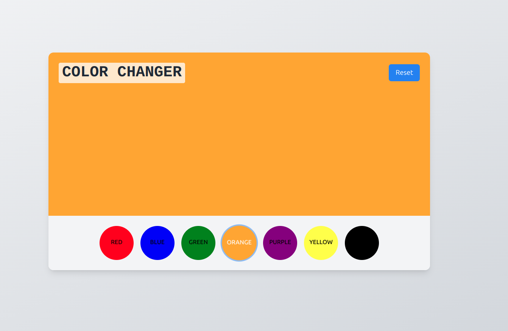

## Background Color Changer In React

# Features

1. Interactive Color Selection: Users can choose from a variety of colors to change the background.
2. Reset Button: A reset button to revert the background to white.
3. Responsive Design: The app is designed to be responsive and work well on different screen sizes.

# Technologies Used

**React**: A JavaScript library for building user interfaces.
**Tailwind CSS**: A utility-first CSS framework for styling the components.
